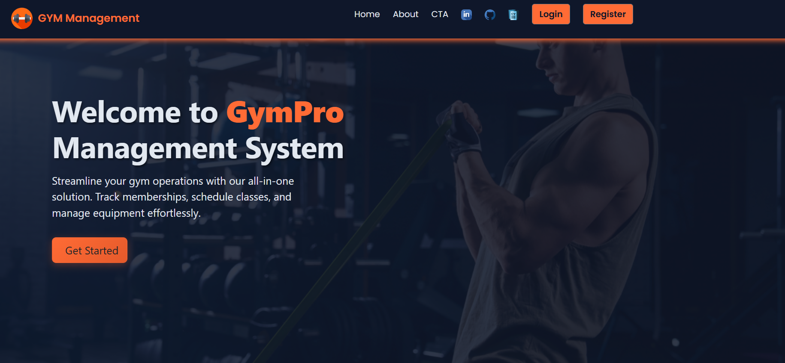
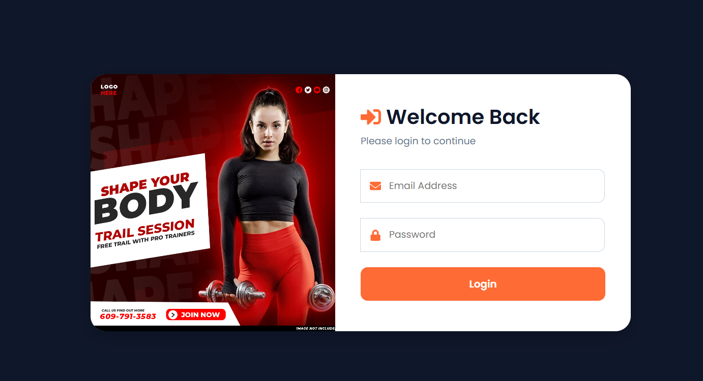
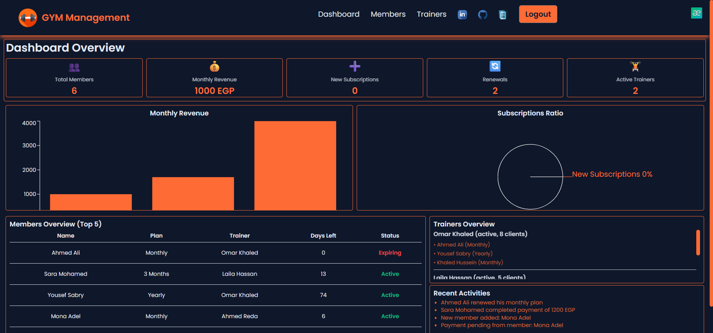
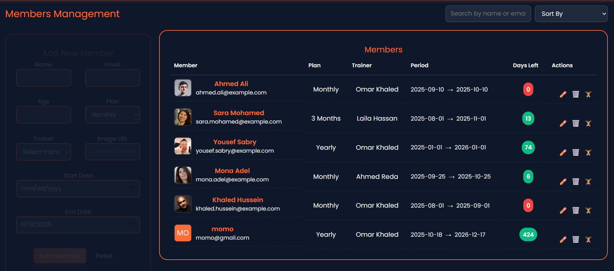
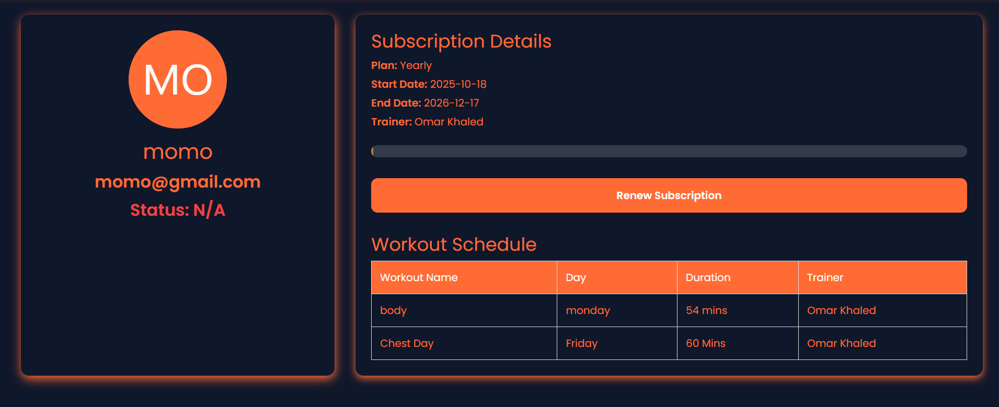
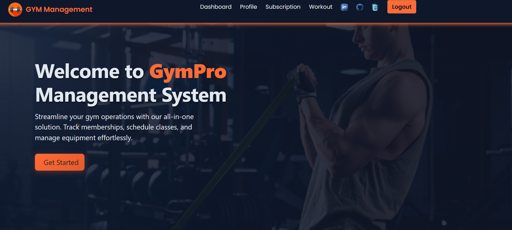
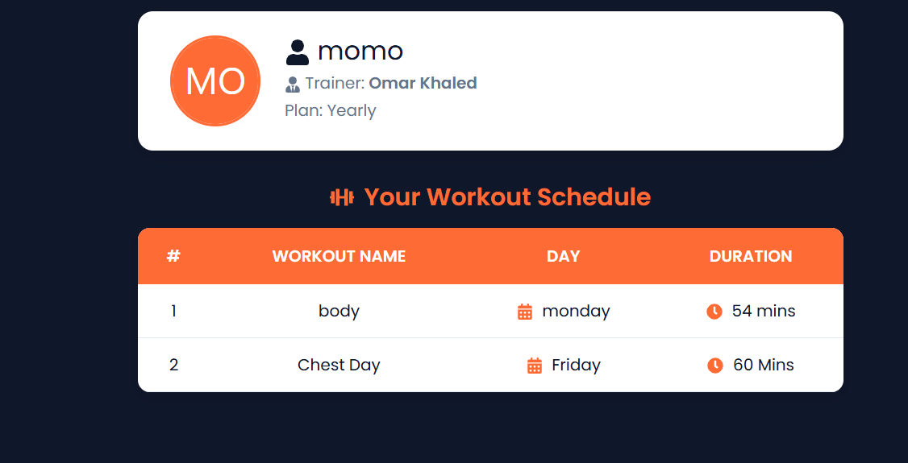
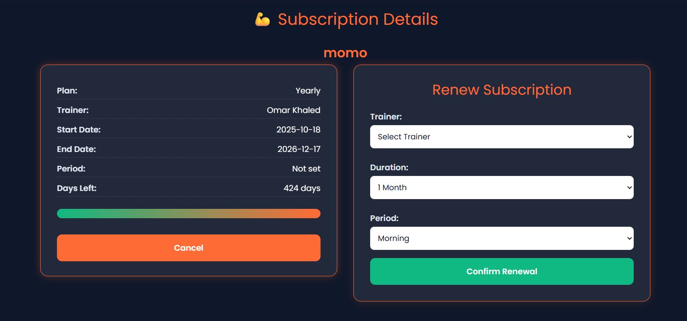

💪 GYMBRO Gym Management System

A modern and responsive Gym Management Website built with React + Vite.
It includes three main sections: Public Pages, Admin Dashboard, and Member Dashboard — designed with clean UI, smooth animations (GSAP), and a consistent color palette for a professional look and seamless user experience.

## 📸 Screenshots

### 🏠 Public Home Page

A clean and modern landing page introducing the Gym Management System.

---

### 🔐 Login Page

Simple and professional login interface for both admins and members.

---

### 🧑‍💼 Admin Dashboard

Powerful admin control panel with full access to members, trainers, and activities.

---

### 💪 Members Management (Admin)

Manage gym members — view, edit, and remove users with an intuitive interface.

---

### 👤 Profile Page (Member)

Members can view and update their personal information with a modern layout.

---

---

### 👤 Member Dashboard

Each member has a personalized dashboard displaying their profile and workout updates.

---

### 🏋️ Workout Schedule

View weekly training plans and assigned trainers with a modern layout.

---

### 💳 Subscription Details

Check current plan, remaining days, and renew membership easily.

🚀 Features

🏠 Public Pages

Home Page — Welcome section with hero banner and gym overview.

About Page — Details about the gym’s mission, trainers, and facilities.

Login & Register — Authentication system for both members and admin.

👨‍💼 Admin Dashboard

Members Management — View, add, edit, and delete members.

Workout Schedule — Assign and update member workout plans.

Payments Tracking — Track subscription status and renewal dates.

GSAP Animations — Smooth transitions and visual enhancements for better UX.

🧍 Member Dashboard

Profile Page — View and edit personal information (name, weight, contact info, etc.).

Subscription Details — Display current plan, days left, and renewal options.

Workout Schedule — View assigned workouts, trainers, and downloadable schedules.

🧩 Tech Stack

⚡ React + Vite — Frontend framework & build tool

🎨 CSS3 + Tailwind-style variables — For responsive design

✨ GSAP (GreenSock) — For smooth animations and transitions

🧠 React Context API — Manage global state (Admin & Member data)

📁 Fake / Local JSON Data or API Integration — For dynamic rendering

🌟 Future Enhancements

🔐 Full authentication with Firebase or Express backend

💳 Online payment integration

📱 PWA version for mobile use

📈 Member analytics and performance tracking

🧑‍💻 Author

Yousef Sabry
Frontend Developer 